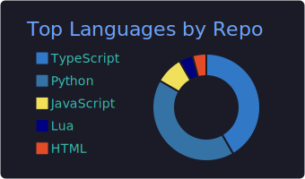
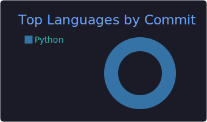
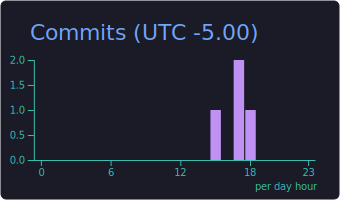

<!--
  restneeded // GitHub profile
  Theme: Tokyo Night. Most projects are private; this README carries the story.
-->

## Hey, I'm Rest 👋

I'm a self taught developer who likes building things end to end and actually shipping them. Most days that looks like full stack web apps, a handful of SaaS products for small businesses, game server tooling, and lately a lot of AI and automation.

I run my own fleet of servers and take projects all the way from an empty folder to something live in production. A good chunk of my work is private client work, so the graph below stays a lot calmer than my actual week.

## What I'm building

- 🛡️ **RestAC** &nbsp;an anticheat and tooling platform for FiveM game servers
- 💼 **SaaS for small business** &nbsp;invoicing, customer ops, analytics, the unglamorous stuff that keeps shops running
- 🎮 **Game server tooling** &nbsp;frameworks, resources, and automation for FiveM and friends
- 🤖 **AI and automation** &nbsp;little systems that do the boring work so I don't have to

## My stack

 

## The numbers

## A closer look

## Trophies

## Recent activity

Thanks for stopping by 🌃

